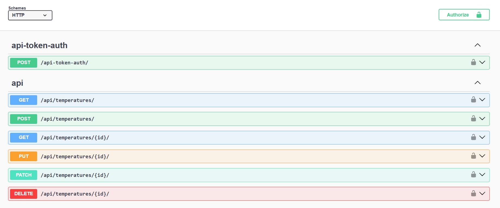
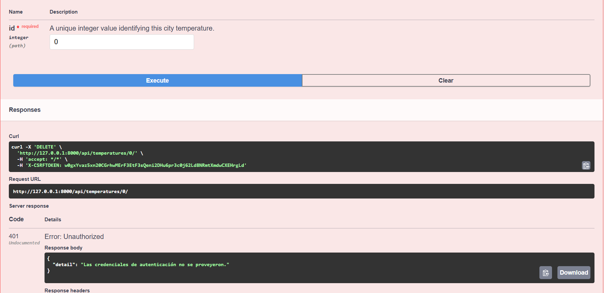

Este proyecto fue desarrollado por **Guillermo Mundarain**, estudiante de Ingeniería de Sistemas, para la materia **Programación 5** con el profesor **Elías Vargas** el **21 de noviembre de 2025**. Consiste en una **API REST** construida con **Django** y **Django REST Framework** que permite registrar y consultar temperaturas por ciudad, con autenticación por token mediante el endpoint `/api-token-auth/`, vistas protegidas para crear, actualizar y eliminar registros, y una vista pública en `/api/temperatures/` para consultar los datos.

El proyecto está configurado con `.gitignore` para excluir archivos sensibles como `db.sqlite3`, `.env` y `__pycache__`. Cuenta con pruebas automatizadas en `temperatures/tests.py` y se instala clonando el repositorio, creando un entorno virtual, instalando dependencias con `pip`, ejecutando migraciones y corriendo el servidor con `runserver`.

La documentación se genera con **drf-yasg** y se visualiza en **Swagger UI** y **Redoc**, con capturas incluidas en la carpeta `docs/` que muestran:

- Los **endpoints disponibles**  
  

- La ejecución de un **GET**  
  

- La creación de un registro con **POST**  
  

- La eliminación con **DELETE**  
  

- La documentación técnica en **Redoc**  
  

Además, se incluyen ejemplos de respuesta JSON como:

```json
[
  {
    "id": 1,
    "city": "Caracas",
    "temperature": "29.50",
    "last_updated": "2025-11-09T12:14:20.706122-04:00"
  }
]


